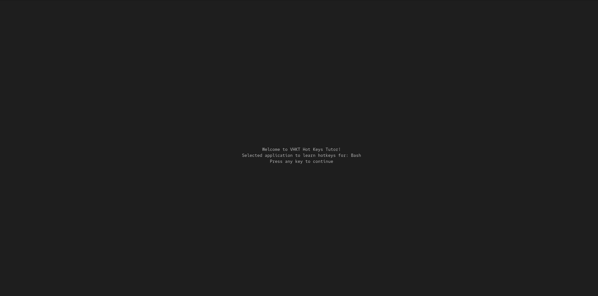
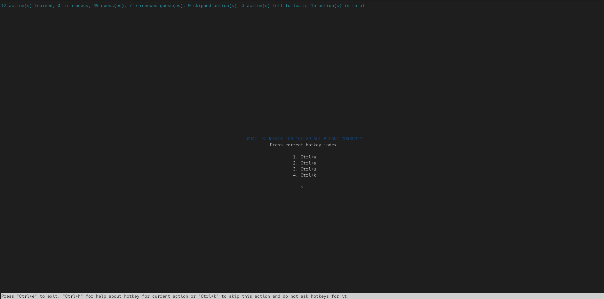
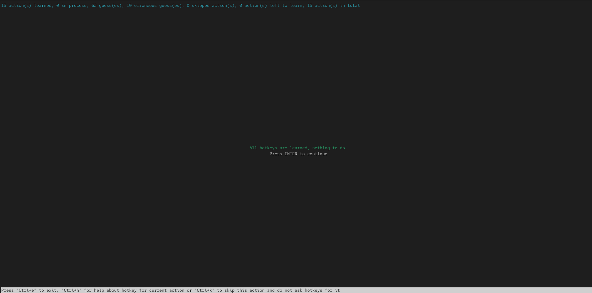

# VHKT


## Intro

VHKT Hotkeys Tutor is a console tool designed to assist in learning
basic hotkeys and commands for popular applications.

## Requirements

To install the required packages, execute the following command from the root
of the repository

```shell
$ pip3 install -r requirements.txt
```

or do something similar from within a virtual environment.

## Basic Usage

Basic hotkeys and commands are described in YAML files in the `hotkeys/` 
directory of the repository. Feel free to use it or create your own using
the same syntax.

The simplest way to call VHKT is to type the command from the repository
directory:

```shell
$ python3 vhkt.py hotkeys/SOME_APP.yaml
```

for example start learning hotkeys for `bash`:

```shell
$ python3 vhkt.py hotkeys/bash.yaml
```

In this case, VHKT will load the specified file, create a blank file with
learning results file with name `.results-for-SOME_APP.yaml`, populate it with
action keys from the hotkeys file, and start its work.

At first, VHKT will show you a welcome screen:



then randomly selected actions will be shown and the app will ask you to
guess the corresponding hotkey or command for each action like here:



To learn a hotkey or command, you need to type it correctly three times.
Made a mistake? That's minus one, try again. Brief statistics for your
learning progress is shown at the top of the screen and some control
hotkeys for the app itself - at the bottom, e.g. press `Ctrl+e` to exit.

When you are done, you will see a message like this:



Then you could proceed to the next application hotkeys file.

Now you can start learning. Good luck!


## Advanced Usage

1. In addition to the default applications hotkeys databases from (`hotkeys/`
   directory), you can create your own using the same syntax and pass it to
   VHKT as the first command-line argument.
2. You can also use several different learning results files. Just pass the
   desired path to VHKT as the `-l/--learning-results-file` command-line
   argument and enjoy.
3. VHKT was created with the intention of being extendable. If you look at
   `vhkt/core.py`, you will see both `Basic...` and `File...` classes. If
   needed, the source code can be extended to work with a database, for
   example, or to support multiple users.
